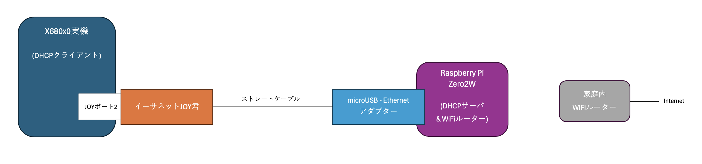
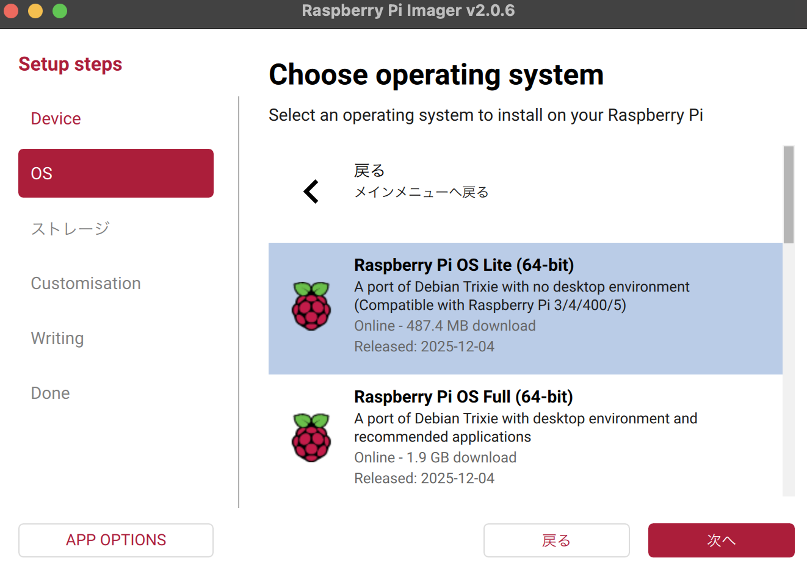

# ethernet-joy-kun-connection

X680x0 + イーサネットじょい君 + Raspberry Pi + Wi-Fi LAN + Internet connection setup guide

---

## はじめに

Raspberry Piを簡易DHCPサーバ兼無線LANルーターとして構成し、X680x0実機とイーサネットじょい君から接続するための覚書です。

### なぜ Raspberry Pi か

yunk氏のイーサネットじょい君により、X680x0実機をネットワークに参加させることが容易になりました。

ただ、我が家の場合はX680x0実機の近くに有線ポートを持つWi-Fiルーターが無く、物理的な接続が難しいという課題があります。

このため、X680x0実機の近くで常時稼働している Raspberry Pi の一つをDHCPサーバ兼Wi-Fiルータとして構成して活用してしまおうというのが趣旨です。

また、この構成を取ることでRaspberry Piとftpなどでファイルのやり取りも可能となります。


---

## 用意するもの

- X680x0実機
- イーサネットじょい君 (https://yunkya2.booth.pm/items/8063175)
- joynetd (https://github.com/yunkya2/joynetd)
- Raspberry Pi (Zero2Wまたは4B/3B+) *家庭内Wi-Fi LANに接続済みであること
- microUSB Ethernetアダプター (4B/3B+の場合は不要)
- イーサネットストレートケーブル (クロスケーブルでも構いません)

---

## ネットワーク構成

### 家庭内LANメインサブネット (192.168.11.x)
* DNS(Wi-FiルータLAN側アドレス) ... 192.168.11.1
* デフォルトゲートウェイ(Wi-FiルータLAN側アドレス) ... 192.168.11.1
* サブネット(Wi-Fi LAN) ... 192.168.11.0/255.255.255.0
* Raspberry Pi IPアドレス(Wi-Fi LAN) ... 192.168.11.101 (DHCP mac address固定取得)

### X680x0側サブネット (192.168.21.x)
* Raspberry Pi IPアドレス(有線LAN) ... 192.168.21.1/255.255.255.0
* X680x0 イーサネットじょい君 IPアドレス(有線LAN) ... 192.168.21.x/255.255.255.0 (DHCP自動取得)

ご自身の環境に合わせて適宜読み替えてください。



---

### 有線LANポートの準備

Raspberry Pi 4B/3B+の場合は標準装備の有線LANポートが使えます。

Raspberry Pi Zero2W は有線LANポートを持っていないので、市販の microUSB Ethernetアダプタを接続します。

https://www.amazon.co.jp/dp/B00G4TS8B4


---

### 設定例 (Raspberry Pi OS v8 Trixie)

2026年3月時点での最新 Raspberry Pi OS (Trixie) での構成例です。



```
$ uname -a
Linux pi4b 6.12.47+rpt-rpi-v8 #1 SMP PREEMPT Debian 1:6.12.47-1+rpt1 (2025-09-16) aarch64 GNU/Linux
```

Raspberry Pi にログインし、ネットワークインターフェイス名を確認します。
```
$ ifconfig
eth0: flags=4099<UP,BROADCAST,MULTICAST>  mtu 1500
        ether xx:xx:xx:xx:xx:x  txqueuelen 1000  (Ethernet)
        RX packets 0  bytes 0 (0.0 B)
        RX errors 0  dropped 0  overruns 0  frame 0
        TX packets 0  bytes 0 (0.0 B)
        TX errors 0  dropped 0 overruns 0  carrier 0  collisions 0
```
有線LANポートは`eth0`として認識されているはずです。

`nmicli`を使って接続名を確認します。
```
$ nmcli connection show
...
netplan-eth0                  xxxxxxx-xxxx-xxxx-xxxx-xxxxxxxxxx  ethernet  --  
```

有線LANポートに固定IPを割り当てます。

```
$ sudo nmcli connection modify "netplan-eth0" \
  ipv4.addresses 192.168.21.1/24 \
  ipv4.method manual \
  ipv4.never-default yes
```

パケット転送を有効にします。

```
$ echo "net.ipv4.ip_forward=1" | sudo tee /etc/sysctl.d/99-ip-forward.conf
$ sudo sysctl -p /etc/sysctl.d/99-ip-forward.conf
```

NATルールを追加。

```
$ sudo nft add table ip nat
$ sudo nft add chain ip nat postrouting { type nat hook postrouting priority 100 \; }
$ sudo nft add rule ip nat postrouting oifname "wlan0" masquerade
```

NATルールの保存。
```
$ sudo nft list ruleset | sudo tee /etc/nftables.conf
$ sudo systemctl enable nftables
$ sudo systemctl restart nftables
```

DHCPサーバの導入。
```
$ sudo apt update
$ sudo apt install dnsmasq
```

`/etc/dnsmasq.conf` を編集。
```
$ sudo mv /etc/dnsmasq.conf /etc/dnsmasq.conf.bak
$ sudo vi /etc/dnsmasq.conf
```

DHCPサーバの設定
```
interface=eth0
# X680x0に割り当てるIPの範囲
dhcp-range=192.168.21.121,192.168.21.130,24h
# デフォルトゲートウェイの通知
dhcp-option=3,192.168.21.1
# DNSサーバーの通知
dhcp-option=6,192.168.11.1
```

DHCPサーバの再起動
```
$ sudo systemctl restart dnsmasq
$ sudo systemctl enable dnsmasq
```

NATテーブル確認
```
$ cat /etc/nftables.conf
```
```
table ip nat {
    chain postrouting {
        type nat hook postrouting priority 100;
        oifname "wlan0" masquerade
    }
}
```

